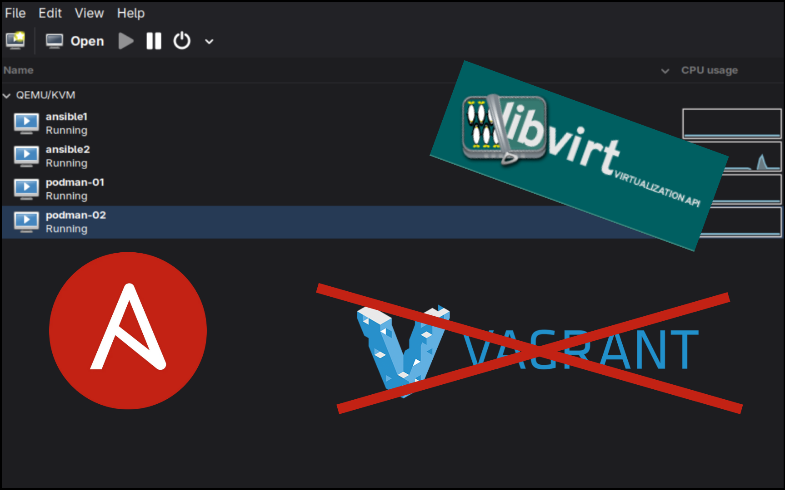

When I started studying for RHCE, I was spending tons of time manually creating and destroying virtual machines. 

I thought.. 

Why not start my automation journey right and automate the deployment stage of my home lab?

I had four goals:
1. Create a Virtual Machine using an Alma 10 Cloud-init image. 
2. Have RAM, Storage, etc. defined in a file. 
3. Set up the root password and ssh keys.
4. Assign an IP address.

I started messing around with deploying virtual machines with a tool called [Vagrant](https://developer.hashicorp.com/vagrant). But it just didn't quite have the amount of flexibility that I wanted. Or had just enough abstraction to get in the way.

Then, I found [Libvirt](https://libvirt.org/index.html) , which is a robust API to interface with KVM machines directly.

So in this guide, we will use Libvirt (using Libvirt Ansible modules) to manage [KVM/QEMU](https://www.qemu.org/) virtual machines and Ansible automate them. This post also builds off of RedHat's guide [here](https://www.redhat.com/en/blog/build-VM-fast-ansible). So be sure to visit there for more details. 

This has been tested on [Fedora Bluefin](https://projectbluefin.io/) and regular-ol Fedora (with adjustments noted). But it should work for Debian-based distros as well. Let me know. 

This setup may seem daunting at first, but the power comes later when you just need a single line to provision a new virtual machine.
## Creating the role
First, initialize the role and remove unused directories. We'll be working out of your Ansible directory from here on out:  
```bash
cd roles && ansible-galaxy role init kvm_provision && cd kvm_provision/ && rm -r files handlers vars`
```

### Defining role variables
Add these default variables to main.yml. You can do a web search for cloud images if you want a different OS. Here, you also define hardware specs, root password information, and IP addressing. 

We'll override some of this in our deployment script later:
`cat defaults/main.yml`

```yaml
---
base_image_name: AlmaLinux-10-GenericCloud-latest.x86_64.qcow2
base_image_url: https://repo.almalinux.org/almalinux/10/cloud/x86_64/images/{{ base_image_name }}
# SHA found next to the image on the site above.
base_image_sha: 8729862a9e2d93c478c2334b33d01d7ee21934a795a9b68550cc1c63ffd0efae 
libvirt_pool_dir: "/var/lib/libvirt/images"
vm_name: Alma10-dev
vm_vcpus: 2
vm_ram_mb: 2048
vm_net: default
vm_root_pass: test123
cleanup_tmp: no
ssh_key: /root/.ssh/id_rsa.pub
ip_addr: 192.168.122.250
gw_addr: 192.168.122.1
vm_mac: 52:54:00:a0:b0:00
disk_size: 20
```

### Libvirt VM Jinja template
The [community.libvirt.virt ](https://docs.ansible.com/projects/ansible/latest/collections/community/libvirt/virt_module.html)Ansible module will be used to provision our KVM Virtual Machine. 

Install the collection:  
```bash
ansible-galaxy collection install community.libvirt
```

This module uses a VM definition file in XML format with [libvirt syntax](https://libvirt.org/formatdomain.html). You can get a template from a current VM and edit from there. 

The power of using a [Jinja template](https://www.davidwrites.xyz/notes/rhce-notes/jinja2templates/) is that we can insert variables to the template for re-usability. This let's us select the RAM, Disk Size, Mac Address, CPUs, and more. The variables are enclosed in curly brackets.

And it's all part of our Ansible automation:

```bash
cat templates/vm-template.xml.j2 
```

```xml
<domain type='kvm'>
  <name>{{ vm_name }}</name>
  <memory unit='MiB'>{{ vm_ram_mb }}</memory>
  <vcpu placement='static'>{{ vm_vcpus }}</vcpu>
  <os>
    <type arch='x86_64' machine='pc-q35-5.2'>hvm</type>
    <boot dev='hd'/>
  </os>
  <cpu mode='host-model' check='none'/>
  <devices>
    <emulator>/usr/bin/qemu-system-x86_64</emulator>
    <disk type='file' device='disk'>
      <driver name='qemu' type='qcow2'/>
      <source file='{{ libvirt_pool_dir }}/{{ vm_name }}.qcow2'/>
      <target dev='vda' bus='virtio'/>
      <address type='pci' domain='0x0000' bus='0x05' slot='0x00' function='0x0'/>
      <!-- Added: Specify the disk size using a variable -->
      <size unit='GiB'>{{ disk_size }}</size>
    </disk>
    <interface type='network'>
      <source network='{{ vm_net }}'/>
      <model type='virtio'/>
      <!-- Added: Specify the mac address using a variable -->
      <mac address="{{ vm_mac }}" />
      <address type='pci' domain='0x0000' bus='0x01' slot='0x00' function='0x0'/>
    </interface>
    <channel type='unix'>
      <target type='virtio' name='org.qemu.guest_agent.0'/>
      <address type='virtio-serial' controller='0' bus='0' port='1'/>
    </channel>
    <channel type='spicevmc'>
      <target type='virtio' name='com.redhat.spice.0'/>
      <address type='virtio-serial' controller='0' bus='0' port='2'/>
    </channel>
    <input type='tablet' bus='usb'>
      <address type='usb' bus='0' port='1'/>
    </input>
    <input type='mouse' bus='ps2'/>
    <input type='keyboard' bus='ps2'/>
    <graphics type='spice' autoport='yes'>
      <listen type='address'/>
      <image compression='off'/>
    </graphics>
    <video>
      <model type='qxl' ram='65536' vram='65536' vgamem='16384' heads='1' primary='yes'/>
      <address type='pci' domain='0x0000' bus='0x00' slot='0x01' function='0x0'/>
    </video>
    <memballoon model='virtio'>
      <address type='pci' domain='0x0000' bus='0x06' slot='0x00' function='0x0'/>
    </memballoon>
    <rng model='virtio'>
      <backend model='random'>/dev/urandom</backend>
      <address type='pci' domain='0x0000' bus='0x07' slot='0x00' function='0x0'/>
    </rng>
  </devices>
</domain>

```

### Defining role tasks
Here is the task list for this playbook. 

```yaml
---
# Commented out for Fedora BlueFin compatibility. Uncomment this if these tools are not installed on your system already.
#- name: Ensure requirements in place
#  community.general.package:
#    name:
#      - guestfs-tools
#      - python3-libvirt
#    state: present
#  become: yes
# List current VMs
- name: Get VMs list
  community.libvirt.virt:
    command: list_vms
  register: existing_vms
  changed_when: no
# Creating the VM
- name: Create VM if not exists
  block:
  - name: Download base image
    get_url:
      url: "{{ base_image_url }}"
      dest: "/tmp/{{ base_image_name }}"
      force: yes
      checksum: "sha256:{{ base_image_sha }}"
      
  - name: Copy base image to libvirt directory
    copy:
      dest: "{{ libvirt_pool_dir }}/{{ vm_name }}.qcow2"
      src: "/tmp/{{ base_image_name }}"
      force: no
      remote_src: yes 
      mode: 0660
      force: yes
    register: copy_results

# Set hostname, copy root ssh keys and password to host, and uninstall cloudinit.  
  - name: Configure the image
    command: |
      virt-customize -a {{ libvirt_pool_dir }}/{{ vm_name }}.qcow2 \
      --hostname {{ vm_name }} \
      --root-password password:{{ vm_root_pass }} \
      --ssh-inject 'root:file:{{ ssh_key }}' \
      --uninstall cloud-init --selinux-relabel
    when: copy_results is changed

# Use the template from earlier
  - name: Define vm
    community.libvirt.virt:
      command: define
      xml: "{{ lookup('template', 'vm-template.xml.j2') }}"
    when: "vm_name not in existing_vms.list_vms"

  - name: Ensure VM is started
    community.libvirt.virt:
      name: "{{ vm_name }}"
      state: running
    register: vm_start_results
    until: "vm_start_results is success"
    retries: 15
    delay: 2

  - name: Ensure temporary file is deleted
    file:
      path: "/tmp/{{ base_image_name }}"
      state: absent
    when: cleanup_tmp | bool

```

## Creating the playbook
You'll want to make sure you have proper permissions to the libvirt directory. I just made myself the owner. Since I am the only one who uses my PC:
```bash
chown -R david:david /var/lib/libvirt/images
```

This playbook will gather variables and run our provisioning role. I have **become** set to **no** for compatibility with immutable distros. You may need to change this to yes if things aren't working right. 

```bash
cat kvm_provision.yaml
```

```yml
---
# Example useage: ansible-playbook kvm_provision.yaml -K -e vm=testvm-01 -e ip_addr=192.168.122.3 -e disk_size=31 -e vm_mac=52:54:00:a0:b0:01

- name: Deploy VM based on cloud image
  hosts: localhost
  gather_facts: yes
  become: no
  vars:
    pool_dir: "/var/lib/libvirt/images"
    cleanup: no
    net: default
    ssh_pub_key: "/var/home/david/.ssh/id_ed25519.pub"
    ansible_password: "{{ ansible_user_pass }}"

  tasks:
    - name: Get VMs list
      community.libvirt.virt:
        command: list_vms
      register: existing_vms
      changed_when: no

    - name: KVM Provision role
      include_role:
        name: kvm_provision
      vars:
        libvirt_pool_dir: "{{ pool_dir }}"
        vm_name: "{{ vm }}"
        vm_vcpus: "{{ vcpus }}"
        vm_ram_mb: "{{ ram_mb }}"
        vm_net: "{{ net }}"
        cleanup_tmp: "{{ cleanup }}"
        ssh_key: "{{ ssh_pub_key }}"
      when: "vm_name not in existing_vms.list_vms"
```

## Assigning an IP address
To assign an IP address to our VM, we need to add a [DHCP reservation](https://www.cyberciti.biz/faq/linux-kvm-libvirt-dnsmasq-dhcp-static-ip-address-configuration-for-guest-os/) for dnsmasq to the Mac-Address for each virtual machine. There are other ways to assign an IP with this setup, but this was the easiest. So here we are. 

You can also change this to a statically assigned IP in a later playbook once you have control over the system.

You will edit the default network xml for libvirt and add the reservation under the \<dhcp\> section like so:
```
<host mac='52:54:00:a0:b0:01' name='podman-01' ip='192.168.122.3'/>
```

Where **podman-01** is the name of our virtual machine.

Edit the network xml with:
```
virsh net-edit default
```  

I added 4 DHCP reservations:
```xml
<network>
  <name>default</name>
  <uuid>4b633d5e-d41d-46da-a383-16e28c61ad05</uuid>
  <forward mode='nat'/>
  <bridge name='virbr0' stp='on' delay='0'/>
  <mac address='52:54:00:7a:fc:07'/>
  <ip address='192.168.122.1' netmask='255.255.255.0'>
    <dhcp>
      <range start='192.168.122.2' end='192.168.122.252'/>
      <host mac='52:54:00:a0:b0:01' name='podman-01' ip='192.168.122.3'/>
      <host mac='52:54:00:a0:b0:02' name='podman-02' ip='192.168.122.4'/>
      <host mac='52:54:00:a0:b0:03' name='ansible1' ip='192.168.122.5'/>
      <host mac='52:54:00:a0:b0:04' name='ansible2' ip='192.168.122.6'/>
    </dhcp>
  </ip>
</network>
```

Then, just restart the dhcp service:  
```
virsh net-destroy default  
virsh net-start default
```

## Site Deployment Script
Now, we just need a script that defines all of the virtual machines for our lab. Here is my script that creates four virtual machines. You'll need the VM name and Mac-address at minimum for this to work. 

```
cat ansible-lab.sh
```

```bash
#!/bin/bash
ansible-playbook kvm_provision.yaml -K -e vm=podman-01 -e ip_addr=192.168.122.3 -e disk_size=31 -e vm_mac=52:54:00:a0:b0:01
ansible-playbook kvm_provision.yaml -K -e vm=podman-02 -e ip_addr=192.168.122.4 -e disk_size=31 -e vm_mac=52:54:00:a0:b0:02
ansible-playbook kvm_provision.yaml -K -e vm=ansible1 -e ip_addr=192.168.122.5 -e disk_size=31 -e vm_mac=52:54:00:a0:b0:03
ansible-playbook kvm_provision.yaml -K -e vm=ansible2 -e ip_addr=192.168.122.6 -e disk_size=31 -e vm_mac=52:54:00:a0:b0:04
```

When you want to add a new virtual machine. You just add it to this file and run the script. You could run the playbook from the command line if you want one-off-VMs-for-testing-purposes.

Give proper permissions and run the script!
```
chmod u+x ansible_lab.sh && ./ansible_lab.sh
```

This run took 8.5 minutes to deploy 4 VMs. In RedHat's guide, they deploy a single virtual machine in 30 seconds. When I added an additional machine to the script with everything cached, it took about 3.5 minutes. 

I have no clue why this setup is taking longer, but I suspect it has something to do with Bluefin, because I was getting much better times when I tried on Fedora. 
```bash
PLAY RECAP *************************************************************************************************************************************************
localhost                  : ok=9    changed=4    unreachable=0    failed=0    skipped=1    rescued=0    ignored=0   


real	8m21.007s
```

Regardless, you should have all of the VMs you listed in your script:
```bash
❯ virsh list
 Id   Name        State
---------------------------
 10   podman-01   running
 11   podman-02   running
 12   ansible1    running
 13   ansible2    running
```

If you want a graphical interface to see your VMs, [Virtual Machine Manager](https://virt-manager.org/) is my go to:


Let's test an ssh connection to podman-01:
```bash
❯ ssh root@podman-01
The authenticity of host 'podman-01 (192.168.122.3)' can't be established.
ED25519 key fingerprint is SHA256:OqxACSatamLG4JAkoP9OA/seMBYYgZRV1ll8h4ExgkE.
This key is not known by any other names.
Are you sure you want to continue connecting (yes/no/[fingerprint])? yes
Warning: Permanently added 'podman-01' (ED25519) to the list of known hosts.
[root@podman-01 ~]# 
```

We now have a virtual machine ready to be configured, thrown away, knotted, and unknotted again. 
## What's next?
For me, I do not want to use root as my Ansible user. I could have added the Ansible user to the VMs using the `--firstboot-command` option during the "**Configure the image**" task. But I could not inject ssh keys for that user. Since the home directory wouldn't exist until the machine is already up and running. 

So i'll be bootstrapping the VMs with another role to set up the Ansible user, ssh, and passwordless sudo privileges.
